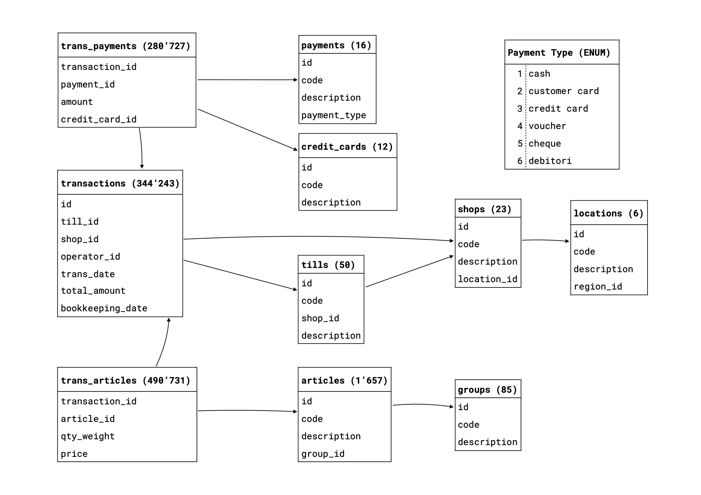

# Data Description - Shops and Tills for  Città di Lugano

[Back to index](./index.md)

## Schema

The data is stored as JSON and divided into 10 files:

| File                  | Description                               | Records |
| --------------------- | ----------------------------------------- | ------: |
| `transactions.json`   | set of transactions                       | 344,243 |
| `trans_payments.json` | payments associated with the transactions | 280,727 |
| `trans_articles.json` | articles associated with the transactions | 490,731 |
| `tills.json`          | tills used for transactions               |      50 |
| `shops.json`          | shops where transactions can be made      |      23 |
| `payments.json`       | payment types used                        |      16 |
| `locations.json`      | locations of the shops                    |       6 |
| `articles.json`       | type of articles                          |   1,657 |
| `groups.json`         | groups of articles                        |      85 |
| `credit_cards.json`   | type of credit cards used for payments    |      12 |



## Example Joins

- join `trans_articles.json` and (`article_id` -> `id`) `articles.json` and (`group_id` -> `id`) `groups.json` to be able to analyze which article groups are most popular
- join `trans_payments.json` and (`payment_id` -> `id`) `payments.json`, and `trans_payments.json` and (`transaction_id` -> `id`) `transactions.json` and (`shop_id` -> `id`) `shops.json` and (`location_id` -> `id`) `locations.json` to be able to analyze which payment types are used at which locations

## Data Examples

### `transactions.json`

```json
{
  "id": 2085118, // unique id, also in `trans_payments.json` and `trans_articles.json`
  "till_id": 53, // reference to `tills.json`
  "shop_id": 24, // reference to `shops.json`
  "operator_id": 150,
  "trans_date": "2018-01-01T14:00:13",
  "total_amount": 25,
  "bookkeeping_date": "2018-01-01T00:00:00"
}
```

### `trans_payments.json`

```json
{
  "transaction_id": 2085118,
  "payment_id": 2, // reference to `payments.json`
  "amount": 25,
  "credit_card_id": 7 // reference to `credit_cards.json`
}
```

### `trans_articles.json`

```json
{
  "transaction_id": 2085118,
  "article_id": 1326,           // reference to `articles.json`
  "qty_weight": 1,
  "price": 10
}
{
  "transaction_id": 2085118,
  "article_id": 1319,
  "qty_weight": 1,
  "price": 15
}
```

### `tills.json`

```json
{
  "id": 53,
  "code": 9,
  "shop_id": 24, // reference to `shops.json`
  "description": "MASI 1"
}
```

### `shops.json`

```json
{
  "id": 24,
  "code": 22,
  "description": "DAC LAC",
  "location_id": 4 // reference to `locations.json`
}
```

### `payments.json`

```json
{
  "id": 2,
  "code": 2,
  "description": "CARTA DI CREDITO",
  "payment_type": 3
}
```

### `locations.json`

```json
{
  "id": 4,
  "code": 30,
  "description": "Attività culturali",
  "region_id": 1
}
```

### `articles.json`

```json
[
  {
    "id": 1319,
    "code": "330010050",
    "description": "intero",
    "group_id": 22 // reference to `group.json`
  },
  {
    "id": 1326,
    "code": "330020203",
    "description": "ridotto, AVS-AI",
    "group_id": 23
  }
]
```

### `groups.json`

```json
[
  {
    "id": 22,
    "code": 3001,
    "description": "Ingresso intero"
  },
  {
    "id": 23,
    "code": 3002,
    "description": "Ingresso ridotto"
  }
]
```

### `credit_cards.json`

```json
{
  "id": 7,
  "code": 7,
  "description": "VISA"
}
```

## Example Data in table format

### Locations

| id  | code | description        | region_id |
| --- | ---- | ------------------ | --------- |
| 1   | 1    | Location           | 1         |
| 2   | 10   | Punto città        | 1         |
| 3   | 20   | Polizia Comunale   | 1         |
| 4   | 30   | Attività culturali | 1         |
| 5   | 40   | Dicastero Sport    | 1         |
| 6   | 50   | UCA                | 1         |

### Shops

| id  | code | description               | location_id |
| --- | ---- | ------------------------- | ----------- |
| 1   | 1    | Puntocittà Lugano         | 2           |
| 2   | 2    | Puntocittà Viganello      | 2           |
| 3   | 3    | Puntocittà Pregassona     | 2           |
| 4   | 4    | Polizia Via Beltramina    | 3           |
| 5   | 6    | DAC Villa Malpensata      | 4           |
| 6   | 5    | Polizia Piazza Riforma    | 3           |
| 7   | 7    | DAC Villa Ciani           | 4           |
| 8   | 8    | DAC MUSEC                 | 4           |
| 9   | 9    | DAC Villa Saroli          | 4           |
| 10  | 10   | DAC Casse Mobili          | 4           |
| 12  | 11   | DS Pista Ghiaccio         | 5           |
| 13  | 12   | DS Piscina Coperta        | 5           |
| 14  | 13   | DS Lido Lugano            | 5           |
| 16  | 14   | DS Lido Riva Caccia       | 5           |
| 17  | 15   | DS Lido San Domenico      | 5           |
| 18  | 16   | UCA Via Balestra          | 6           |
| 19  | 17   | Polizia Via Balestra      | 3           |
| 20  | 18   | Puntocittà Pambio Noranco | 2           |
| 21  | 19   | Puntocittà Sonvico        | 2           |
| 22  | 20   | DSU                       | 2           |
| 23  | 21   | DS Piscina Carona         | 5           |
| 24  | 22   | DAC LAC                   | 4           |
| 25  | 23   | MASI                      | 4           |

### Tills

| id  | code | shop_id | description                         |
| --- | ---- | ------- | ----------------------------------- |
| 1   | 1    | 1       | CAS04301 Via della Posta - 1        |
| 2   | 2    | 1       | CAS04302 Via della Posta - 2        |
| 3   | 3    | 1       | CAS04303 Via della Posta - 3        |
| 4   | 4    | 1       | CAS04304 Via della Posta - 4        |
| 5   | 5    | 3       | CAS04401 Pregassona                 |
| 6   | 6    | 2       | CAS04501 Viganello                  |
| 7   | 1    | 4       | CAS03001 Via Beltramina - 1         |
| 8   | 2    | 4       | CAS03002 Via Beltramina - 2         |
| 9   | 3    | 6       | CAS03101 Piazza Riforma             |
| 10  | 1    | 5       | CAS10202 Villa Malpensata - 1       |
| 11  | 2    | 5       | CAS10202 Villa Malpensata - 2       |
| 13  | 1    | 7       | CAS10301 Villa Ciani                |
| 14  | 1    | 8       | CAS10101 MUSEC                      |
| 15  | 1    | 9       | CAS10001 Villa Saroli - 1           |
| 16  | 1    | 10      | CAS10901 Cassa Mobile - 1           |
| 17  | 2    | 10      | CAS10902 Cassa Mobile - 2           |
| 18  | 2    | 9       | CAS10002 Villa Saroli - 2           |
| 19  | 1    | 12      | CAS11401 Pista del Ghiaccio         |
| 20  | 1    | 13      | CAS11002 Piscina Coperta            |
| 21  | 3    | 10      | CAS10903 Cassa Mobile - 3           |
| 22  | 1    | 14      | CAS11001 Lido Lugano Foce           |
| 23  | 1    | 18      | CAS02001 UCA Passaporti             |
| 24  | 1    | 19      | CAS03201 Via Balestra               |
| 25  | 2    | 12      | Dicastero Sport - PC Lisa Caspescha |
| 26  | 2    | 14      | CAS11002 Lido Lugano Abbonamenti    |
| 27  | 3    | 14      | CAS11003 Lido Lugano Centrale 1     |
| 28  | 4    | 14      | CAS11004 Lido Lugano Centrale 2     |
| 29  | 5    | 14      | CAS11005 Lido Lugano Shop 1         |
| 30  | 6    | 14      | CAS11006 Lido Lugano Shop 2         |
| 31  | 1    | 16      | CAS11201 Lido Riva Caccia           |
| 32  | 1    | 17      | CAS11301 Lido San Domenico          |
| 33  | 7    | 20      | CAS04601 Pambio                     |
| 34  | 1    | 21      | CAS04701 Sonvico                    |
| 35  | 1    | 22      | CAS04801 DSU                        |
| 36  | 1    | 23      | CAS11401 Piscina di Carona          |
| 37  | 2    | 23      | CAS11402 Piscina di Carona          |
| 38  | 99   | 10      | Azzeramento Carte                   |
| 39  | 1    | 24      | CAS10401 LAC - 1                    |
| 40  | 2    | 24      | CAS10402 LAC - 2                    |
| 41  | 3    | 24      | CAS10403 LAC - 3                    |
| 42  | 4    | 24      | PC responsabile biglietteria LAC    |
| 43  | 5    | 24      | CAS10901 LAC - Mobile 1             |
| 44  | 6    | 24      | CAS10902 LAC - Mobile 2             |
| 45  | 7    | 24      | CAS10903 LAC - Mobile 3             |
| 46  | 8    | 24      | CAS10403 LAC - 4                    |
| 51  | 1    | 25      | MASI 1                              |
| 52  | 2    | 25      | MASI 2                              |
| 53  | 9    | 24      | MASI 1                              |
| 54  | 10   | 24      | MASI 2                              |
| 55  | 2    | 8       | CAS10102 MUSEC                      |

### Transactions

| id      | till_id | shop_id | operator_id | trans_date              | total_amount | bookkeeping_date        |
| ------- | ------- | ------- | ----------- | ----------------------- | ------------ | ----------------------- |
| 2851656 | 19      | 12      | 68          | 2019-09-25 15:06:56.000 | 6            | 2019-09-25 00:00:00.000 |
| 2851655 | 3       | 1       | 6           | 2019-09-25 15:06:21.000 | 15           | 2019-09-25 00:00:00.000 |
| 2851653 | 1       | 1       | 7           | 2019-09-25 15:04:32.000 | 30           | 2019-09-25 00:00:00.000 |
| 2851652 | 20      | 13      | 133         | 2019-09-25 15:04:24.000 | 0            | 2019-09-25 00:00:00.000 |
| 2851650 | 20      | 13      | 133         | 2019-09-25 15:03:57.000 | 6            | 2019-09-25 00:00:00.000 |
| 2851649 | 19      | 12      | 68          | 2019-09-25 15:03:11.000 | 3            | 2019-09-25 00:00:00.000 |
| 2851648 | 19      | 12      | 68          | 2019-09-25 15:02:45.000 | 12           | 2019-09-25 00:00:00.000 |
| 2851647 | 19      | 12      | 68          | 2019-09-25 15:02:14.000 | 7            | 2019-09-25 00:00:00.000 |
| 2851646 | 1       | 1       | 7           | 2019-09-25 15:00:30.000 | 15           | 2019-09-25 00:00:00.000 |
| 2851644 | 7       | 4       | 88          | 2019-09-25 14:58:03.000 | 80           | 2019-09-25 00:00:00.000 |
| 2851643 | 20      | 13      | 133         | 2019-09-25 14:56:59.000 | 0            | 2019-09-25 00:00:00.000 |
| 2851642 | 23      | 18      | 106         | 2019-09-25 14:52:52.000 | 105          | 2019-09-25 00:00:00.000 |
| 2851641 | 3       | 1       | 6           | 2019-09-25 14:51:11.000 | 25           | 2019-09-25 00:00:00.000 |
| …       | …       | …       | …           | …                       | …            | …                       |

### Payments

| id  | code | description                 | payment_type(\*) |
| --- | ---- | --------------------------- | ---------------- |
| 1   | 1    | CONTANTI                    | 1                |
| 2   | 2    | CARTA DI CREDITO            | 3                |
| 3   | 3    | EURO                        | 1                |
| 4   | 10   | CONTANTI EpsiPol            | 1                |
| 5   | 20   | CARTA DI CREDITO EpsiPol    | 3                |
| 6   | 30   | EURO Polizia                | 1                |
| 7   | 4    | Debitori                    | 6                |
| 8   | 40   | CARTA CLIENTE               | 2                |
| 10  | 41   | Offerto Card LAC            | 1                |
| 11  | 42   | Caricamento Card a Contanti | 1                |
| 12  | 43   | Caricamento Card in EUR     | 1                |
| 13  | 44   | Caricamento Card con CC     | 3                |
| 14  | 45   | CARTA CLIENTE DEBITORI      | 2                |
| 15  | 5    | UBS Key                     | 5                |
| 16  | 46   | CARTA CLIENTE LAC           | 2                |
| 17  | 6    | Pagamento con CC telefonico | 5                |

(\*) Payment type
1: cash, 2: customer card, 3: credit card, 4: vaucher, 5: cheque. 6: debitori

### Transaction-payments

| transaction_id | payment_id | amount | credit_card_id |
| -------------- | ---------- | ------ | -------------- |
| 2851661        | 2          | 78     | 5              |
| 2851660        | 1          | 25     | NULL           |
| 2851659        | 1          | -6.3   | NULL           |
| 2851657        | 1          | 78     | NULL           |
| 2851656        | 1          | 6      | NULL           |
| 2851655        | 1          | 15     | NULL           |
| 2851653        | 2          | 30     | 5              |
| 2851650        | 2          | 6      | 9              |
| 2851649        | 1          | 3      | NULL           |
| 2851648        | 1          | 12     | NULL           |
| …              | …          | …      | …              |

### Articles

| id  | code     | description                  | group_id |
| --- | -------- | ---------------------------- | -------- |
| 1   | 999999   | ARTICOLO LIBERO 1            | NULL     |
| 2   | 11240001 | Tessera res. Gandria per SNL | 12       |
| 3   | 11200007 | Copia conforme               | 2        |
| 4   | 11200001 | Autentica firma              | 2        |
| 5   | 11200002 | Autentica fotografia         | 2        |
| 6   | 11200003 | Buona condotta               | 2        |
| 7   | 11200004 | Diritti civili               | 2        |
| 8   | 11200005 | Esistenza in vita            | 2        |
| 9   | 11200006 | Flexi Card                   | 2        |
| 10  | 11230001 | Economia domestica           | 3        |
| 11  | 17000002 | Caccia bassa                 | 2        |
| 12  | 11230002 | Economia domestica copia     | 3        |
| 13  | 11230003 | Domicilio/dimora             | 3        |
| 14  | 11230004 | Domicilio/dimora per         | 3        |
| 15  | 11230009 | Fotocopia                    | 3        |
| 16  | 11230005 | Domicilio/dimora cp          | 3        |
| …   | …        | …                            | …        |

### Transaction-articles

| transaction_id | article_id | qty_weight | price |
| -------------- | ---------- | ---------- | ----- |
| 2851681        | 882        | -1         | -20   |
| 2851680        | 782        | 1          | 6     |
| 2851678        | 782        | 1          | 6     |
| 2851678        | 782        | 1          | 6     |
| 2851676        | 147        | 1          | 40    |
| 2851675        | 19         | 1          | 25    |
| 2851674        | 817        | 1          | 6     |
| 2851673        | 9          | 1          | 40    |
| 2851673        | 9          | 1          | 40    |
| 2851672        | 765        | 1          | 3     |
| 2851672        | 761        | 1          | 8     |
| 2851671        | 5          | 1          | 25    |
| …              | …          | …          | …     |

### Credit cards

| id  | code | description      |
| --- | ---- | ---------------- |
| 5   | 5    | MAESTRO          |
| 6   | 6    | MASTERCARD       |
| 7   | 7    | VISA             |
| 8   | 8    | POSTCARD         |
| 9   | 9    | V PAY            |
| 10  | 10   | AMEX             |
| 11  | 11   | DINERS           |
| 12  | 12   | AMERICAN EXPRESS |
| 13  | 4    | JCB              |
| 14  | 3    | UNION PAY        |
| 15  | 13   | CUP              |
| 16  | 14   | TWINT            |

### Article groups

| id  | code | description                              |
| --- | ---- | ---------------------------------------- |
| 92  | 3015 | Diversi                                  |
| 91  | 119  | EcoCard                                  |
| 90  | 502  | Animazioni e Servizi tempo libero e lavo |
| 89  | 3613 | LAC Edu - LAC -                          |
| 88  | 3612 | LAC Edu - Teatro -                       |
| 87  | 3611 | LAC Edu - Musica -                       |
| 86  | 3620 | LAC diversi                              |
| 85  | 3610 | LAC Edu - Arte -                         |
| 84  | 3602 | LAC visite guidate Parco                 |
| 83  | 3601 | LAC visite guidate LAC e Ex Convento     |
| 82  | 3600 | LAC visite guidate Teatro                |
| 78  | 3999 | MuseoArteSvizzeraItaliana                |
| 77  | 3998 | OrchestraSvizzeraItaliana                |
| 76  | 3997 | LuganoMusica                             |
| 75  | 3996 | LuganoInScena                            |
| …   | …    | …                                        |
