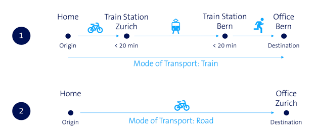

# Trip count data (Swisscom)

[Back to index](./index.md)

The hourly trip count data is contained in the `tripcount_hourly_TRIPTYPE.csv` files. 

`TRIPTYPE` can be:

* `all`: all trip types
* `fromhereto`: A trip whose origin is inside the area of interest.
* `incomingfrom`: A trip whose destination is inside the area of interest.
* `withinarea`: A trip that is completely inside the area of interest.
* `passingthrough`: A trip that goes through the area of interest and whose origin and destination are outside the area of interest.

Inside each csv file, the following columns are provided:

* `Date`: the date and hour for the grouped trips.
* `Total`: the total trip count
* `Transport Mode: Train`: Trips that are mainly or entirely made by train.
* `Transport Mode: Highway`: Trips on the road with more than 50% of the trip duration spent on the highway.
* `Transport Mode: Road`: Remaining trips (considered on the roads).
* `Reason: Commute`: Trips that start or end at the user’s identified workplace; a workplace is where the user spends most of his time during working days from 8 am to 5 pm.
* `Reason: Non-Commute`: Remaining Trips.

Example:

1. Trip 1 has road and train component, but the majority of the trip is by train. So the mode of transport for the trip is train.

2. Self evident.

